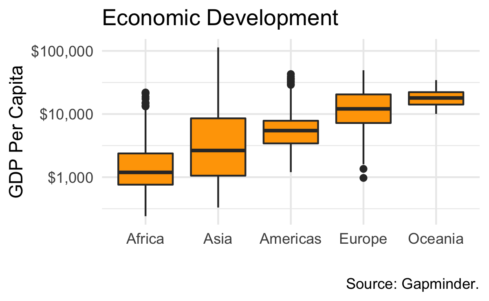

```{r}
packages <- c("tidyverse", "gapminder")
for (package in packages){
    if (!require(package, character.only = TRUE)) {
        install.packages(package, repos = "https://cloud.r-project.org")
        library(package, character.only = TRUE)
    }
}
rm(package, packages)
pdta <- gapminder
```

# Warmup

You should never rush blindly into data vizualization. Hence, let's
study our target graph in detail before we hack any code into $\mathcal{R}$.
Answer each of the five questions below.



1. What is your data?

2. What relationships do you want to see?

3. How do you want to see it?

4. What additional information do you want to see?

5. What scales, axes, labels should be shown?

# Get to work!

Let's translate your answers into code. Fill the dots in the code boxed below.

1. What is your data?
```{r}
head(...)
```

2. What relationships do you want to see?
```{r}
p <- ggplot(data = ..., mapping = aes(x = ..., y = ...))  # Map(!) data to plot.
```

3. How do you want to see it?
```{r}
p <- p +
    geom_...(fill = "orange")  # Set(!) the fill color.
```

4. What additional information do you want to see?
```{r}
# Anything to do here?
```

5. What scales, axes, labels should be shown?
```{r}
p <- p +
    labs(
    x = "",
    y = "GDP Per Capita",
    title ="Economic Development",
    caption = "Source: Gapminder."
  ) +
  scale_..._...(labels = scales::dollar) +  # See help(package = "scales")
  theme_minimal()  # ggplot2 and ggthemes offer numerous themes.
```

Let's take a look at the result.
```{r}
print(p)
```

# Conclusion

Congratulations! You have just created your first piece of ggplot2 art. Now, find something more demanding to replicate. Check the following links for inspiration:

- Silver, N. and McCann, A. (2014) How to Tell Someone’s Age When All You Know Is Her Name. URL: https://fivethirtyeight.com/features/how-to-tell-someones-age-when-all-you-know-is-her-name/, last accessed: 11/05/2019.
- Selva Prabhakaran (2017): Top 50 ggplot2 Visualizations - The Master List (With Full R Code). URL: http://r-statistics.co/Top50-Ggplot2-Visualizations-MasterList-R-Code.html, last accessed: 11/05/2019
- Use Google's image search and look for ggplot2 examples.
